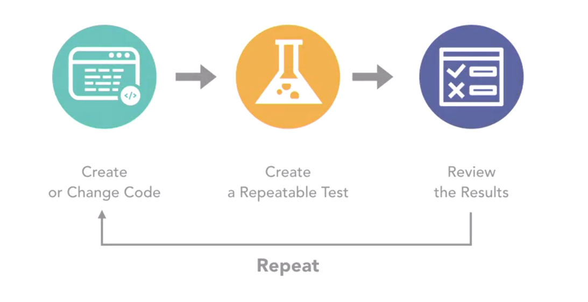

| Learning objectives                             |
|-------------------------------------------------|
| Writing unit tests in C# Working with simple and multidimensional arrays Managing ordered and unordered data with lists Evaluating conditions with if-else statements Using OR, AND, and NOT operators Building loops Debugging and handling exceptions Creating the final build of my C# project |

* [Unit testing][1] & TDD

`Based on whether or not our tests pass or fail, I repeat the process,` either fixing problems or mistakes that I've made or moving on to the next feature that we're supposed to develop. `When we practice test-driven development, our main goal is to have 100% coverage.` This means that all exposed methods in the project have unit tests written that exercise them fully. Unit tests can be run from within Visual Studio for developer productivity, or I can automate them as part of a continuous integration process using tools like [Jenkins][2], [TeamCity][3], or [Azure DevOps Server][4] (ex TFS :kissing_closed_eyes:).

:closed_book: Check this link for more information about TDD & DEVOps!  [Introducing TDD, CI, DevOps ][5]

[A unit test](https://www.lambdatest.com/blog/nunit-vs-xunit-vs-mstest/) is a test that exercises individual software components or methods, also known as "unit of work". Unit tests should only test code within the developer's control. They do not test infrastructure concerns. Infrastructure concerns include interacting with databases, file systems, and network resources.

**Characteristics of a good unit test**:

:raised_hands:`Fast`. It is not uncommon for mature projects to have thousands of unit tests. Unit tests should take very little time to run. Milliseconds.

:raised_hands:`Isolated`. Unit tests are standalone, can be run in isolation, and have no dependencies on any outside factors such as a file system or database.

:raised_hands:`Repeatable`. Running a unit test should be consistent with its results, that is, it always returns the same result if you do not change anything in between runs.

:raised_hands:`Self-Checking`. The test should be able to automatically detect if it passed or failed without any human interaction.

:raised_hands:`Timely`. A unit test should not take a disproportionately long time to write compared to the code being tested. If you find testing the code taking a large amount of time compared to writing the code, consider a design that is more testable.

***

* Arrays & Collections

* Flow Control

* Exception Handling

* Going to production

  [1]: https://docs.microsoft.com/en-us/dotnet/core/testing/#testing-tools
  [2]: https://www.jenkins.io/
  [3]: https://www.jetbrains.com/teamcity/
  [4]: https://azure.microsoft.com/en-us/services/devops/server/
  [5]: https://abdusabri.com/tdd-ci-devops/
